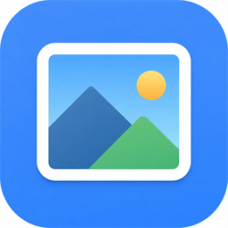

  

<h1 align="center">XemAnh</h1>

  <strong>Mở ảnh là xem ngay.</strong> 
  Trình xem ảnh nhẹ cho Windows — không quảng cáo, không tài khoản, không rườm rà.

  <a href="installer/xemanh-0.1.0-setup.exe">Tải bản cài đặt</a>
  · Windows 10 / 11

---

Photos của Windows nặng, chậm, hay kéo bạn vào OneDrive. XemAnh làm đúng một việc: **mở ảnh cho đẹp, cho nhanh, cho dễ**.

Double-click file ảnh → cửa sổ vừa khít tấm hình → lướt sang ảnh kế bên. Xong.

## Vì sao dùng XemAnh

- **Mở là thấy ảnh** — không splash screen, không hỏi đăng nhập, không nút bấm thừa.
- **Cửa sổ vừa với ảnh** — nhìn một tấm hình thì hiện một tấm hình, không bị khung đen khổng lồ.
- **Lướt cả thư mục** — mũi tên trái/phải để xem hết ảnh trong cùng thư mục, không cần mở từng file.
- **Phóng to đúng chỗ cần xem** — lăn chuột để zoom, kéo để pan; double-click để về vừa khít.
- **Ảnh điện thoại không bị nằm nghiêng** — tự xoay đúng chiều khi mở.
- **Xóa nhầm vẫn cứu được** — Delete đưa vào Thùng rác Windows, không mất vĩnh viễn.
- **PNG trong suốt hiện rõ** — nền caro, thấy đúng chỗ trong suốt.
- **Tên file tiếng Việt, Trung, Nhật… hiện đúng** — không bị lỗi font trên thanh tiêu đề.
- **Gọn** — một phần mềm nhỏ, cài xong dùng ngay, không chạy ngầm.

## Cài đặt

1. Tải [xemanh-0.1.0-setup.exe](installer/xemanh-0.1.0-setup.exe)
2. Chạy file cài đặt (không cần quyền Administrator)
3. Double-click bất kỳ ảnh nào để mở bằng XemAnh

Sau khi cài, XemAnh được gán làm trình xem mặc định cho các định dạng ảnh thông dụng. Muốn đổi lại Photos thì vào *Cài đặt Windows → Ứng dụng → Ứng dụng mặc định*.

Gỡ cài đặt như phần mềm Windows thông thường: *Cài đặt → Ứng dụng*.

## Dùng như thế nào

Mở một ảnh (double-click, hoặc kéo thả vào XemAnh). Các ảnh khác trong cùng thư mục sẵn sàng để lướt.

| Bạn muốn | Làm vậy |
| --- | --- |
| Ảnh kế / ảnh trước | `→` `←` hoặc `Page Down` / `Page Up` |
| Ảnh đầu / ảnh cuối thư mục | `Home` / `End` |
| Phóng to, thu nhỏ | Lăn chuột (zoom tại vị trí con trỏ) |
| Di chuyển ảnh đang zoom | Giữ chuột trái và kéo |
| Về vừa khít cửa sổ | Double-click, hoặc bấm `0` |
| Toàn màn hình | `Space` |
| Thoát toàn màn hình / thoát app | `Esc` (bấm lần nữa để thoát) |
| Xoay phải và lưu | `R` |
| Xoay trái và lưu | `Shift` + `R` |
| Xóa ảnh (vào Thùng rác) | `Delete` |

Thanh tiêu đề hiện tên file và vị trí trong thư mục, ví dụ `biển.jpg [3/12] - XemAnh`.

## Định dạng hỗ trợ

JPG, JPEG, PNG, BMP, GIF, TGA — và các biến thể thường gặp như JFIF, JPE, DIB.

Phù hợp ảnh chụp, ảnh thiết kế, screenshot, sticker PNG trong suốt.

## XemAnh phù hợp với ai

- Xem ảnh hàng ngày cho nhanh, không thích Photos / trình xem cồng kềnh
- Designer, illustrator lướt sprite, UI, PNG trong suốt
- Ai thường mở ảnh có tên tiếng Việt hoặc tiếng Trung
- Máy cần phần mềm nhẹ, cài xong dùng luôn

Không phải trình sửa ảnh. Không có layer, filter, hay cloud. Đó là chủ ý: xem ảnh thì nên đơn giản.
